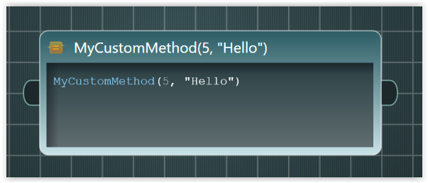

<p align="center">
  
</p>

# ArticyImporter for Unreal Engine

The Unreal Engine importer allows integrating articy:draft content into Unreal projects and provides a simple C++ and blueprint interface to work with the data. We release this importer as a GitHub open source project that will provide a substantial head start into incorporating articy:draft data into Unreal projects while still allowing enough flexibility to adjust the importer to personal needs. 

While full support is not guaranteed for this product, we're constantly working on improvements and would love to hear your suggestions. Feel free to forward us your ideas or even better directly [contribute](https://github.com/ArticySoftware/ArticyImporterForUnreal/blob/master/CONTRIBUTING.md) to the development of the importer.

# Table of contents

* [Features](#features)
* [Setup](#setup)
  * [Export from articy:draft](#export-project-from-articydraft)
  * [Import into Unreal](#import-into-unreal)
* [Using the API](#using-the-api)
  * [Getting an object](#getting-the-object)
  * [Using the Flow Player](#articy-flow-player)
  * [Custom Script Methods](#custom-script-methods)
  * [Multiple Global Variable Sets](#multiple-global-variable-sets)
* [Common Issues](#common-issues)

# Features

This importer provides a working foundation for integrating articy:draft content into Unreal Engine projects. You can expect the following features including but not limited to:

 * Everything accessible via **C++** and **Blueprint**
 * **Flow player** for automatic configurable flow traversal as an actor component
 * Automatic import
 * Articy Asset Picker for easy lookup and selection of your articy data
 * Database with your project data. *Excluding Journeys, Settings, Template constraints* 
 * Use of Unreal Engine's localization

# Setup

There are a couple of steps needed to get the importer up and running. The Unreal project must be C++ compatible, therefore please ensure that the required tools are installed, such as Visual Studio for Windows or XCode for Mac.

To find out more about how to set up Visual Studio, click [here](https://docs.unrealengine.com/en-US/Programming/Development/VisualStudioSetup/index.html).

Following options are available when first using the importer:

## Create a new project

To create a new project, select a project template of your choice and in the next step choose to use C++. You will still be able to use Blueprints, however, your project will immediately support C++!

<p align="center">
  
</p>

After you have created a new project, close the Unreal editor for now.

## For already existing Blueprint-only projects

Projects that existed prior to using the importer and used only Blueprints can be converted to C++ projects by adding any C++ class that inherits from UObject to the project. It is important that an option <b>other</b> than None gets selected. As an example, we choose the Actor class.

<p align="center">
  
</p>

<p align="center">
  
</p>

Click Next, name the class "MyActor" and finish the setup. Unreal Engine should now compile the "MyActor" class. After having compiled, your project now also works with C++.

## Downloading the plugin

You can decide to get the plugin at the [Unreal Engine marketplace](https://www.unrealengine.com/marketplace/en-US/product/articy-draft-importer) as an Engine plugin, or alternatively here via GitHub as a project-based plugin. Functionally, there are no differences.

### Project-based plugin
*Unreal Engine 4.19 and below: use [the respectively tagged version](https://github.com/ArticySoftware/ArticyImporterForUnreal/releases) of the importer*

Get a copy of the importer and copy it into your projects **Plugins** folder. It is possible that you don't have one if it is a new project, so you can just create it.
Copy the folder **ArticyImporter** into this **Plugins** folder. Your project structure should now look something like this.

<p align="center">
  
</p>

### Engine-based plugin
If you decide to get the plugin on the marketplace, the Epic Games Launcher will handle the installation for you.

## Adjust build configuration

For Unreal to correctly build the importer we need to add it as a dependency, to do that locate the file **Source/\<ProjectName>/\<ProjectName\>Cpp.Build.cs**

<p align="center">
  
</p>

And open it in your favorite text or code editor.

Now we need to adjust the existing code and make sure that the Importer is a dependency for the project. Locate the `PublicDependencyModuleNames` array and add `"ArticyRuntime"` as an additional dependency. 
If you are working on macOS, you should also add `"Json"` to `PrivateDependencyModuleNames`.

Your file should now look something like this:

```cpp
// Copyright 1998-2019 Epic Games, Inc. All Rights Reserved.

using UnrealBuildTool;

public class MyProject : ModuleRules
{
	public MyProject(ReadOnlyTargetRules Target) : base(Target)
	{
		PCHUsage = PCHUsageMode.UseExplicitOrSharedPCHs;
	
		PublicDependencyModuleNames.AddRange(new string[] { "Core", "CoreUObject", "Engine", "InputCore", "ArticyRuntime" });

		PrivateDependencyModuleNames.AddRange(new string[] {  });

		// Uncomment if you are using Slate UI
		// PrivateDependencyModuleNames.AddRange(new string[] { "Slate", "SlateCore" });
		
		// Uncomment if you are using online features
		// PrivateDependencyModuleNames.Add("OnlineSubsystem");

		// To include OnlineSubsystemSteam, add it to the plugins section in your uproject file with the Enabled attribute set to true
	}
}
```

Make sure to save the file and close the editor.

## Enable the importer in Unreal

Now you can open your Unreal project and open the Plugins window by selecting Edit->Plugins in the main window menu bar.
Inside this window scroll in the list of groups down until you find the Group **Project** (in case you are using the plugin on a project basis), or under **Installed** (in case you are using it as an engine plugin) and the sub group **Articy**, click on Articy and enable the ArticyImporter on the right.

<p align="center">
  
</p>

After enabling the importer the window will prompt you to restart the editor, please do so to activate it for your project. When the editor restarts it will prompt you to rebuild missing DLL files for the importer which you should confirm. This can take a bit depending on the size of the project and the power of your computer but once finished the Unreal editor should be back up again.

## Export project from articy:draft

Now that the importer is running, you are ready to export your data from articy:draft.

Open your articy:draft project and open the export window. Here you will find the Unreal Engine export. Please note that the Unreal export uses [Rulesets](https://www.articy.com/help/Exports_Rulesets.html) to choose what and how to export.

When exporting, chose your Unreal projects **Content** folder as the target for the `.articyue4` export file.

<p align="center">
  
</p>

## Import into Unreal
**Warning: Please make sure you have your project's build configuration adjusted**

After every export, going back to Unreal will trigger the ArticyImporter plugin to automatically parse the new file and show a prompt to import the changes. While this option is generally robust, there are certain cases in which more control over the import process is required.

For greater control over your imports, use the Articy Importer Menu. It can be accessed through the Articy Importer button on the Level Toolbar (UE4) or through the Settings menu (UE5).

**Unreal Engine 4**


**Unreal Engine 5**


### Importer Modes

- **Full Reimport**: This option will always regenerate code and compile it, and afterwards generate the articy assets
- **Import Changes**: This option will only regenerate code and compile it if necessary, but will always regenerate assets. This is generally faster than a full reimport and is the same as clicking on 'Import' on the prompt Unreal shows you when you've exported.
- **Regenerate Assets**: This option will only regenerate the articy assets based on the current import data asset and compiled code.

# Using the API

Now that the importer is installed and your project data is imported you can start working on your project. 
Here are some quick tips at what to look for so you won't go in completely blind:

## Assigning an ArticyRef

To get access to your objects, an ArticyRef struct is used.
An ArticyRef variable can be assigned using the custom asset picker.


## Getting the object

Once you have assigned your ArticyRef variable, you can then get access to the object by calling the 'Get Object' function. The returned object is an ArticyObject that requires casting or alternatively, the 'Get Object' function will cast it for you to the specified class.

A simple setup that prints the display name of the selected ArticyObject is shown below. Please note that the 'Get Display Name' function is an interface call, meaning that you don't need to cast if the object has a display name. If the object does not have a display name, such as a dialogue fragment, an empty text is returned.

<p align="center">
  
</p>

There are many other ways to access your objects, check this screenshot for a blueprint sample code showing you how to access an object by id/technical or directly clone it. The ArticyDatabase is the central object that lets you access all imported articy data. Even the 'Get Object' function above makes use of the ArticyDatabase.

Also make sure to cast the object to the desired type to get access to its properties and its template.

<p align="center">
  
</p>

## Accessing properties

Most of the time if you want to access the properties of an objects you queried from the database or got passed by the flow player callbacks (see below) you need to
cast the object to the correct type first. 

If you have an object without a template the type to cast into is easy.
Every built-in class is named as the object in articy:draft with your project name as a prefix. Lets say your project is named `ManiacManfred` so you will find `ManiacManfredFlowFragment`, `ManiacManfredDialogueFragment`, `ManiacManfredLocation`, `ManiacManfredEntity` and a lot more. 
All those respective objects have their expected properties, so you will find the `Speaker` property inside the `ManiacManfredDialogueFragment` object etc.

<p align="center">
  
</p>

> You will also find classes with the `Articy` prefix. Those are the base classes for the generated classes and casting into them works almost the same. This would allow you to create code that is reusable
> independent of any imported project.  

Dealing with templates is a bit more complicated. First thing to understand is that **all your articy:draft templates are new types** inside Unreal. 

The name of your template types also follows a similar structure as the one mentioned before, but utilizing the Templates technical name: `<ProjectName><TemplateTechnicalName>`. So if your project is called *ManiacManfred* and your templates technical name is *Conditional_Zone* your correct type would be called `ManiacManfredConditional_Zone`.
Its also worth mentioning that even if it is a new type, it is still derived from the base type with all its properties.

Accessing is easy once you have cast the object into the correct type, just drag a connection out of the node and search for the type to see all its properties.

<p align="center">
  
</p>

For templates it works the same way, but you will also find fields for every feature inside your template, so in the case of the `Conditional_Zone` template, there is a `ZoneCondition` field for the feature with the same name.
> Please note: It is possible that the **context sensitive** search does not properly work at this point in blueprint. When you disable it, you should be able to see all the fields inside your object.

Some properties are a bit more complex like reference strips and scripts:

* Scripts contain methods to `Evaluate` the underlying script. You can also access the `Expression` which is the original script in text form.
* ReferenceStrips and QueryStrips are just arrays.
* ReferenceSlots, `Speaker`, `Asset` inside the `PreviewImage` etc. are of type `ArticyId`, which can be plugged into `GetObject`.

So to reiterate:

1. Get object and cast to appropriate type.
2. Access the property/feature.
3. If it is a feature you access now the property inside the feature. <br/>
3a. If it is a script method, you can execute it via the `Evaluate` method.

<p align="center">
  
</p>


## Articy Flow Player

The flow player is used as an automatic traversal engine. 
To set it up you add the Flow player actor component to one of your actors:

<p align="center">
  
</p>

Now you can customize the flow player by setting the necessary options in the Setup section of the details panel. Most interestingly are **Pause On** and **Start On**. The StartOn attribute can also be set dynamically via code before traversing through the dialogue.

<p align="center">
  
</p>

If you scroll down you will find the components event section. Here you probably want to add events for **On Player Paused** and **On Branches Updated**

<p align="center">
  
</p>

Adding those will create new event nodes in the graph of your current actor and allow you to implement your custom logic. 

To quickly reiterate how to use those: **On Player Paused** is called with the current paused object of the flow traversal, the current spoken dialogue fragment for example; and **On Branches Updated** to create the user choices for the current pause.

Here is an example blueprint implementation for both methods

<p align="center">
  
</p>

The `ShowPausedObject` method is to display the current pause on the UI. Here is the implementation of that method.


<p align="center">
  
</p>

`spokenText` is bound to a UI text block.


And the **On Branches Updated** is used to create a vertical list of buttons. How to create those buttons, creating the layout etc. is out of scope of this quick guide but it is important that you
store the branch in every button. When you instantiate the button you should pass in the reference used in the for-loop and when the button is clicked you use that branch as the index for the flow player so it knows where to continue.

<p align="center">
  
</p>

If you want to learn more about the flow player and its events you can read the [unity documentation](https://www.articy.com/articy-importer/unity/html/howto_flowplayer.htm) as both implementations are based on the same principles.


## Custom Script Methods

It's possible to add new script methods into articy:draft's Expresso scripting language. These can trigger side effects in your game such as moving game objects or changing UI states, or they could return helpful values such as the location of the player.

Getting started with custom script methods is easy. Simply start using new methods in articy:draft as if they already exist (as pictured below) and import your project into Unreal.



The importer will detect these methods, infer their parameter types and return signatures (in the example above, one integer and one string), and generate an Interface you can implement in Blueprint or C++ with their implementations.

There are three ways you can implement this interface.

1. Implement the interface on an actor containing an `ArticyFlowPlayer` component. Any time that flow player component encounters a custom method, it'll call the function on this parent actor.
2. Implement the interface on a component deriving from a `ActicyFlowPlayer` component. Any time this flow player encounters a custom method, it'll call the function on itself.
3. Implementing the interface on a custom `UObject` and setting that class as the `User Methods Provider` on a `ArticyFlowPlayer` component. Any time that flow player encounters a custom method, it'll call the function on a new instance of that object.

Each flow player can only use one of the above methods (you can't mix and match). 

Choose one and create or open the corresponding Blueprint (whether it's the actor, the component, or the custom `UObject`). Go to `Class Settings` and add the interface generated from your Articy project to the Interfaces list.


Now, you can start implementing your custom methods. To do this, find the method in the `Interfaces` list under `My Blueprint` (bottom left), right-click it, and select `Implement event`.


This will create a new event node in your Blueprint graph with all the appropriate parameters.


You'll notice the types of each parameter are automatically deduced based on how you used the function in Articy. Now, attach some nodes (if you just want to test it, try a Debug Print to start) and test it out.

*Note: You may notice your method is called earlier and more often than expected. This is because Articy "scans ahead" in branches to find which ones are valid. To avoid executing your logic twice, see [Shadowing](#shadowing).*

### Custom Methods that Return

You can also define custom Expresso script methods that have return values.


To create implementations for these in Blueprint, use the Override function method in the Blueprint editor on the object that implements your interface.


Then, you'll get a custom function in Blueprint that can return a value.


### Shadowing

You'll notice that if you put custom script methods into Instructions, Conditions or Pins, the methods will be executed *before* the node is actually reached by the Flow Player.

This is because the flow player scans ahead while figuring out which branches are valid and not. This is how it knows which choices to show and which to hide. In order to make these decisions, it needs to run instructions and conditions ahead of time to see if any fail.

Obviously, this would create problems if any of these scripts modify variables or properties, so the flow player goes into a **shadow state** when doing this. While shadowing, the flow player duplicates the global variables and other state so that changes made by instructions do not affect the real, current state.

All this is handled automatically and requires no input from you.

However, Articy doesn't know what your custom script methods do. If they have side effects (such as changing the state of your game or displaying something on the UI), it doesn't know that these shouldn't be executed during the shadow state.

You need to handle this yourself.

Thankfully, this is easy to handle with the `Is in shadow state?` Blueprint node available on the Articy Database. Gate any side effects your function has behind this method returning `False` to ensure they're only run when the node is actually being executed.


If your custom function has a return value, however, you still want to make sure it runs as normally. Remember: shadowing is how articy decides what branches are valid or not. If you return a different value while shadowing than you would otherwise, articy won't be able to figure out the proper list of branches to return. Only use `Is in shadow state?` to gate side-effects.

## Multiple Global Variable Sets

Some games may require having multiple independent sets of global variables, such as each player having their own variable set. 

This is supported via the `Override GV` property of the `ArticyFlowPlayer` component.

To create a new, independent set of global variables, right-click in your Content window and find `Alternative Articy Global Variables`. 


Now, you can simply set the `Override GV` property on your flow player to this asset. Any two flow players with the same setting will share variables, and any flow players with this property unset will share the default global variables.


Similar to the default global variables set, these new sets respect the `Keep global variables between worlds` setting of your project. If it's turned on, changes to these global variables will persist across level boundaries. If it is turned off, each will reset to their default values anytime the level changes.

### Getting Variable Sets in Blueprint and C++

If you want to access the values in these sets in Blueprint or C++, you need to use the `Get Runtime GVs` method/node on the Articy Database. The `Alternative Articy Global Variables` asset is just a dummy placeholder, so it has no data itself. You need to use this method to access the runtime data.


Pass the asset reference into the `Get Runtime GVs` method and it will return the active runtime clone for that set.

### Getting the Current Variables during Custom Script Calls

If you're writing a handler for a [custom script method](#custom-script-methods), you may want to access the variable set currently being used in execution.

When an expresso script is running, the `Get GVs` method/Blueprint node on the Articy Database will return the *active global variables instance* that the flow player is using.


## Articy Global Variables Debugger
The Global Variables debugger can be accessed in the toolbar at the top of the level editor (UE4) or the Settings menu on the right hand side of the level editor (UE5). It shows all global variables while the game is running and lets you search by namespace or variable name which makes it easy to follow what is happening inside the game and to debug problems in relation to global variables.

Furthermore, you can also change the global variables while the game is running, and your game code that listens to variable changes is going to get triggered. This is useful to replicate specific conditions without needing to go through all steps manually.

For example, if your global variables control your quest states, checking a "quest accepted" global variable in the debugger will make your quest system initiate a quest.

## UMG Rich Text Support

If your articy:draft project has been exported using either the Unity Rich Text or Extended Markup formatting settings, you can use articy with the Unreal Rich Text Block widget to display richly formatted text.

### Export and Import Configuration

First, make sure you select one of these two settings in the `Export options` dialog in articy:draft


Then, you'll need to enable a setting in Unreal to convert Unity rich text formatting to Unreal's format. **NOTE: Make sure you click `Import Changes` anytime you change this setting. You can find it in the [Articy Import Window](#import-into-unreal).**


### Configuring Styles

Next, you have to configure your styles by creating a style data table in Unreal. This asset tells the rich text widget what fonts, colors, and other styling effects to apply to each kind of text. Create this asset by creating a new `Data Table` in your Content window (under `Miscellaneous`) and for the row structure, pick `RichTextStyleRow`.


Next, open the new data table and create your styles. You'll need to import a few fonts into your project to do this. On Windows, you can find the fonts installed under `C:\Windows\Fonts`. Drag one into your Unreal project to import it.

You'll need to create a new row for every combination of styles you want to support. The first row is always the default style: what you'll get if there's no formatting set on text.

Create a `b` row for a bold style. You can also create an `i` row for italic and `u` for underline. Make sure to set the appropriate font and style setting for each type.

To support combinations (such as bold **and** italic), you need to create combination rows. Each combination is always alphabetically ordered. So, to support bold and italic, you'd create a `bi` row. For bold and underline, `bu`. For all three: `biu`. You need to create a row for each unique combination to tell Unreal which font to use. Usually, when importing a font, you'll get versions for each combination.

**Example:**


### Configuring your Rich Text Control

Once these are all set, you can configure your rich text control. Create a Rich Text block in the UI editor and set it's Text Style Set to your new data table.


Now, you'll be able to see your styling in articy appear in Unreal! Try setting the text to the text of a formatted node in articy to test.

### Color Support

*Note: Colors are only available with the extended markup option in the articy:draft export.*

To support additional styling like custom colors, you need to add the `ArticyRichTextDecorator` to the list of `Decorator classes` on the rich text block.


### Hyperlinks

*Note: Hyperlinks are only available with the extended markup option in the articy:draft export.*

To use hyperlinks from Articy, you'll need to do two things:

1. Add the interface `ArticyHyperlinkHandler` to your user widget that owns the rich text control. You can do this in `Class Settings` under interfaces. Then, implement the `On Hyperlink Navigated` method to catch the event of users clicking the hyperlinks.
2. Sub-class `ArticyRichTextDecorator` with a new Blueprint class and configure its `HyperlinkStyle` property. This will control the regular, hover, and underline style behavior of the hyperlinks. Then, use this new blueprint class as your Decorator class on the rich text control instead of `ArticyRichTextDecorator`.

## Advanced features (requiring C++)
There are some specific workflow features that can be exposed to Blueprints using C++ only.

### UPROPERTY meta data
There are currently three articy UPROPERTY meta specifiers.
- **ArticyClassRestriction** (for FArticyId and FArticyRef): Restricts the articy asset picker to the given class and, on its own, its descendants. The class is assigned without the C++ Prefix (i.e. UArticyEntity becomes ArticyEntity)
- **ArticyExactClass** (for FArticyId and FArticyRef): Restricts the Exact Class checkbox in the articy asset picker to the specified value. Useful to exclude child classes of a given class in combination with ArticyClassRestriction
- **ArticyNoWidget** (for FArticyId). This is a performance optimization for large projects and can be used to disable the custom widgets for FArticyIds, as they are more computationally expensive.

Below is example code:
```cpp
class AMyActor : public AActor
{
public:
	GENERATED_BODY()
	
	UPROPERTY(EditAnywhere, meta = (ArticyClassRestriction=ArticyNode, ArticyExactClass = true)
	FArticyRef NodeReference;
	
	UPROPERTY(EditAnywhere, meta = (ArticyClassRestriction=ArticyEntity, ArticyNoWidget = true)
	FArticyId EntityId	
}
```

### ArticyId Widget Customization
The ArticyId Widget customization is a system to let you add custom widgets to any ArticyId or ArticyRef property in the Unreal Engine editor without having to modify the plugin code. The Articy button that opens up the currently selected object inside articy:draft 3 itself is also implemented using the same system.

The system also allows you to test the associated object for its data, or to only use your custom widget for specific types of articy objects. For example, all objects that have a "Quest giver" feature in articy:draft 3 can show a button inside Unreal that will open up the asset in which the associated quest is contained.

To create a customization, there are three steps:
1. Create a Customization class inheriting from IArticyIdPropertyWidgetCustomization and override its functions. This class is responsible for actually creating the FExtender and the widget for the customization.
2. Create a Customization Factory class inheriting from IArticyIdPropertyWidgetCustomizationFactory and override its functions. The SupportsType function gives you the object that is being considered for customization as a parameter, so you can retrieve its data and decide whether the factory supports the articy object or not.
3. Register the Customization Factory with the ArticyCustomizationManager that resides in the FArticyEditorModule using a FOnCreateArticyIdPropertyWidgetCustomizationFactory object, which is going to instantiate a factory internally.

Sample code can be found in the following files inside the ArticyEditor module, which demonstrates how the articy button itself was added:
- "DefaultArticyIdPropertyWidgetCustomizations" (Customization + Factory)
- "ArticyEditorModule" (Registering of the factory via FOnCreateArticyIdPropertyWidgetCustomizationFactory object)

Keep in mind that this customization needs to be stripped from a packaged build, so this should only be done in an editor module.
The editor module needs to have "ArticyEditor" listed as a dependency.
Additionally, to get access to the customization manager from outside the FArticyEditorModule, use the following code:
```cpp
FArticyEditorModule::Get().GetCustomizationManager()->RegisterArticyIdPropertyWidgetCustomizationFactory...
```
# Contributing

We are very grateful for any kind of contribution that you bring to the ArticyImporter, no matter if it is reporting any issues, or by actively adding new features, or fixing existing issues. If you want to know more about how to contribute please check our [Contribution](https://github.com/ArticySoftware/ArticyImporterForUnreal/blob/master/CONTRIBUTING.md) article.

# Common Issues

## `Error: Could not get articy database` when Running a Packaged Build

The Articy Generated assets like the Database and Packages are probably not making it into your final packaged build, hence the error. 

Make sure the `ArticyContent` folder is listed under `Additional Asset Directories to Cook` in your project's `Packaging` settings.


To verify the Articy assets are actually making it into the package, you can use the UnrealPak utility included with Unreal to unzip the packaged build and check the bundled assets.

Run the following command:

```bash
UnrealPak.exe "C:\Path\To\Your\ShippingBuild\WindowsNoEditor\ProjcetName\Content\Paks\ProjectName.pak" -Extract "C:\Path\To\Extract\To"
```

Replacing the paths to match the location of your exported build and a temporary directory to extract to. Make sure to use absolute paths, as we've found UnrealPak behaves best with them.

Then, check the contents of that directory and ensure that the Articy Generated assets are in the `ArticyContent/Generated` folder.

The `UnrealPak` executable is located in the `\Engine\Binaries` folder in your Unreal installation. On Windows, it's at `\Engine\Binaries\Win64\UnrealPak.exe`. 

## Files Marked as Delete in Perforce/Plastic SCM

Older versions of the plugin had issues with various source control plugins for Unreal like Perforce and Plastic SCM. Frequently, generated Articy assets would get marked as `delete` instead of `edit`, making it easy to accidentally commit to your repository without these critical assets.

These issues have been fixed in version `1.3.0` of the plugin. If you're still seeing issues with source control after updating, [create an issue on GitHub](https://github.com/ArticySoftware/ArticyImporterForUnreal/issues/new/choose) or contact support@articy.com for assistance.

## My Articy Assets (Textures/Sounds) are Not Appearing in Unreal

Make sure you are exporting directly from Articy into your Unreal game directory. Alongside the `.articyue4` file there should be an `ArticyContent` directory with all your assets. 

Both need to be copied into your Unreal project.

## Hot Reloading Drop-Down List Changes

Because of [a known issue with Unreal and hot-reloading changes to enums](https://issues.unrealengine.com/issue/UE-19528?lang=zh-CN), be very careful when hotreloading any changes to the values in a Drop-down list. If you save any Blueprint using the generated enum after hotreloading, you'll likely have all those nodes broken (converted into `bytes`) the next time you open the editor.

When importing drop-down list changes, it's best to restart Unreal to avoid issues.

## Error C2451: a conditional expression of type 'const TWeakObjectPtr<UObject,FWeakObjectPtr>' is not valid

If you're getting the above error after updating to version `1.4` of the Articy Unreal plugin, you need to make a manual fix to your generated C++ file to get Unreal started.

Find `{ProjectName}ExpressoScripts.h` (where `{ProjectName}` is the name of your articy:draft project) in `Source\{UnrealProjectName}\ArticyGenerated` and delete the method `GetUserMethodsProviderObject` (should be around line `50`ish).

Once the project succesfully compiles and opens, run a [Full Reimport](#importer-modes).

## Detailed step by step import process

Here is a full detailed step by step process to configure Ureal to be able to import Articy content properly :

1- Create an Ureal C++ project

2- Uncheck "Hot Reload" inside Editor preferences (to prevent concurency with Live Coding session)
`Edit > Editor preferences > "General" section => "Miscellaneous" >`
Uncheck "Automatically compile newly added C++ Classes" (in Unreal 5, Live coding tries to do this as well, that leads to race conditions over buildings & locked already build DLLs ...)
        
3- Save all and CLOSE the Editor / project    
=> ! important NOTE ! :  
If the Unreal Editor isn't closed, the first version of the project can't be build inside Visual studio. Even if this is not mandatory, it's far better to build a first version of the project outside the editor BEFORE doing the initial import, as the first import can fail if the Unreal project isn't already build because of the way Live Coding handles incremental compilation.
ALTERNATIVELY 
Also, the first import succeeds much more when the user firstly play the initial level before importing content from Articy... Then it's not necessary to build the first project outside of the Editor (Steps 4 / 5 / 6) BUT Editor neets to be closed / Reopend (step 3) to remove the Hot reload Editor references. So, as the Unreal editor must be closed at this moment, it's probably more natural to add the VERY IMPORTANT "ArticyRuntime" dependency at this time (step 5-).
	
4- Open the visual studio project

5- Add the "ArticyRuntime" dependency (very important) : 
edit the followng file :
`<Project Path>\Source\<Project Name>\<project_name>.Build.cs`
This file is automatically generated by Unreal when you create a c++ project. 
[NOTE : It may be more than 3 files generated inside this folder depending on which kind of Template you choose when creating the project. 
An empty project will generate only necessary Unreal build tool files (3 files) when a third person project (by example) will generate 4 more files at less...]
Inside the file, add 
```c#    
"ArticyRuntime"
```
To make the PublicDependencyModuleNames like the following line :
```c#
PublicDependencyModuleNames.AddRange(new string[] { "Core", "CoreUObject", "Engine", "InputCore", "HeadMountedDisplay", "ArticyRuntime" });
```
This will tell to Unreal Engine build tool to take in account the Articy Dll when building project, otherwise Unreal build will fail.
    
6- Do a fresh build of the project inside Visual studio. 
=> This will create the basic DLL for Live Coding to begin with the C++ project.
	
7- Re-Open the project inside Unreal editor

5- Export articy project inside Unreal (directely at the root of the "Content" folder)
=> After a shot time, this action should trigger a "Import changes" message into the Unreal side, and the importer should have generated some code files inside the "<Project Path>\Source\<Project Name>\ArticyGenerated" folder
=> Import the changes and wait Live coding compilation to finish (the first import can take some time, but the other ones are faster)
=> To confirm that the importation finished sucessfully, some Unreal structures might have been generated inside the C++\<Project_Name>\ArticyGenerated folder.